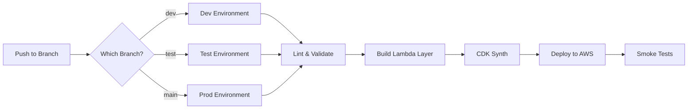

# CI/CD Pipeline for Kafka Lambda Consumer

Automated deployment pipeline using GitHub Actions with multi-environment support.

## 🎯 Overview

This pipeline automatically deploys your Kafka Lambda Consumer to different AWS accounts based on the branch:

- `dev` → Dev AWS Account
- `test` → Test AWS Account  
- `main` → Prod AWS Account

## 📋 Quick Start

### 1. Configure AWS (One-time Setup)

See [GITHUB_ACTIONS_SETUP.md](./GITHUB_ACTIONS_SETUP.md) for detailed AWS setup.

**TL;DR:**
```bash
# In each AWS account, create OIDC provider and IAM role
# Replace with your values
./scripts/setup-aws-oidc.sh YOUR_ORG YOUR_REPO ACCOUNT_ID
```

### 2. Configure GitHub Secrets

See [SECRETS.md](./SECRETS.md) for the complete list.

**Quick Setup:**
```bash
gh secret set AWS_ACCOUNT_DEV --body "111111111111"
gh secret set AWS_ACCOUNT_TEST --body "222222222222"
gh secret set AWS_ACCOUNT_PROD --body "333333333333"
gh secret set AWS_DEPLOY_ROLE_NAME --body "GitHubActionsDeployRole"
gh secret set KAFKA_BOOTSTRAP_SERVERS_DEV --body "kafka-dev:9092"
gh secret set KAFKA_TOPIC_DEV --body "events-dev"
# ... (see SECRETS.md for complete list)
```

### 3. Deploy

```bash
# Push to dev
git checkout dev
git push origin dev

# Push to test
git checkout test
git push origin test

# Push to prod
git checkout main
git push origin main
```

## 🔄 Pipeline Workflow



## 📊 Pipeline Jobs

### 1. Setup (30s)
- Determines target environment from branch
- Maps to correct AWS account
- Sets deployment variables

### 2. Lint (1 min)
- Runs `flake8` on Python code
- Runs `black` formatter check
- Validates Lambda handler syntax
- Validates CDK app syntax

### 3. Build Layer (2 min)
- Builds Lambda layer with dependencies
- Checks layer size (< 250MB)
- Uploads layer artifact

### 4. Synth (1 min)
- Downloads layer artifact
- Installs CDK dependencies
- Synthesizes CloudFormation template
- Uploads template artifact

### 5. Deploy (3-5 min)
- Configures AWS credentials via OIDC
- Downloads artifacts
- Bootstraps CDK (if needed)
- Deploys stack to AWS
- Uploads deployment outputs

### 6. Smoke Tests (1 min)
- Verifies Lambda function exists
- Verifies DynamoDB table exists
- Verifies EventBridge rule exists
- Invokes Lambda function
- Checks CloudWatch logs

**Total Pipeline Time:** ~8-10 minutes

## 🎮 Triggering Deployments

### Automatic (Push)

```bash
# Deploy to dev
git checkout dev
git commit -am "Update Lambda handler"
git push origin dev

# Deploy to test
git checkout test
git merge dev
git push origin test

# Deploy to prod
git checkout main
git merge test
git push origin main
```

### Manual (GitHub UI)

1. Go to **Actions** tab
2. Select **Deploy Kafka Lambda Consumer**
3. Click **Run workflow**
4. Choose environment (dev/test/prod)
5. Click **Run workflow** button

### Via API

```bash
# Trigger workflow via GitHub API
gh workflow run deploy-lambda.yml \
  -f environment=prod \
  --ref main
```

## 🔍 Monitoring

### View Active Runs

```bash
# List recent workflow runs
gh run list --workflow=deploy-lambda.yml

# Watch a specific run
gh run watch RUN_ID

# View logs
gh run view RUN_ID --log
```

### GitHub UI

Navigate to: `Actions` → `Deploy Kafka Lambda Consumer`

Each run shows:
- ✅ Job status (passed/failed)
- 📊 Deployment summary
- 📝 CloudWatch logs
- 🏗️ Stack outputs

## 🛡️ Security

### AWS Credentials

- ✅ Uses **OIDC** (no long-lived credentials)
- ✅ Temporary session tokens
- ✅ Auto-expires after workflow
- ✅ Scoped to specific repositories

### Secrets Management

- ✅ Encrypted at rest
- ✅ Never logged
- ✅ Access controlled
- ✅ Rotatable

### Environment Protection

Configure in `Settings` → `Environments`:

```yaml
# .github/environments/prod.yml
protection_rules:
  - required_reviewers: 2
  - wait_timer: 300  # 5 minutes
```

## 🚨 Troubleshooting

### Pipeline Fails at "Configure AWS credentials"

**Problem:** OIDC provider or IAM role not configured

**Solution:**
```bash
# Verify IAM role exists
aws iam get-role --role-name GitHubActionsDeployRole

# Check trust policy
aws iam get-role --role-name GitHubActionsDeployRole \
  --query 'Role.AssumeRolePolicyDocument'
```

### Pipeline Fails at "Build Layer"

**Problem:** Layer exceeds 250MB size limit

**Solution:**
```bash
# Check local layer size
cd lambda && ./build_layer.sh
du -sh layer/python

# Optimize dependencies in layer/requirements.txt
```

### Pipeline Fails at "CDK Deploy"

**Problem:** Stack already exists or permission denied

**Solution:**
```bash
# Check existing stacks
aws cloudformation list-stacks \
  --stack-status-filter CREATE_COMPLETE UPDATE_COMPLETE

# Verify IAM permissions
aws sts get-caller-identity
```

### Smoke Tests Fail

**Problem:** Lambda function not responding

**Solution:**
```bash
# Check Lambda logs
aws logs tail /aws/lambda/kafka-consumer-lambda-dev --follow

# Manually invoke Lambda
aws lambda invoke \
  --function-name kafka-consumer-lambda-dev \
  --payload '{}' \
  response.json
```

## 📈 Best Practices

### 1. Branch Strategy

```
main (prod)
  ↑
test
  ↑
dev
  ↑
feature/* (no auto-deploy)
```

### 2. Pull Requests

- Always PR to `dev` first
- Require code reviews
- Enable status checks
- Block direct pushes to `main`

### 3. Testing

- Test in `dev` first
- Promote to `test` after validation
- Deploy to `prod` only after approval

### 4. Rollback

```bash
# Option 1: Revert commit
git revert HEAD
git push origin main

# Option 2: Rollback via CloudFormation
aws cloudformation rollback-stack \
  --stack-name KafkaConsumerLambdaStack-prod
```

### 5. Monitoring

- Set up CloudWatch alarms
- Monitor Lambda errors
- Track DynamoDB throttles
- Alert on deployment failures

## 🔧 Customization

### Change Deployment Frequency

Edit `.github/workflows/deploy-lambda.yml`:

```yaml
# Deploy only on specific files
paths:
  - 'lambda/lambda_function/**'
  - 'lambda/cdk_app/**'
```

### Add Slack Notifications

```yaml
- name: Notify Slack
  if: always()
  uses: slackapi/slack-github-action@v1
  with:
    webhook-url: ${{ secrets.SLACK_WEBHOOK_URL }}
    payload: |
      {
        "text": "Deployment ${{ job.status }}: ${{ github.ref_name }}"
      }
```

### Add More Environments

1. Create new branch: `staging`
2. Add to workflow triggers
3. Add secrets: `AWS_ACCOUNT_STAGING`, etc.
4. Update setup job mapping

## 📚 Additional Resources

- [GitHub Actions Documentation](https://docs.github.com/en/actions)
- [AWS CDK Documentation](https://docs.aws.amazon.com/cdk/)
- [OIDC with GitHub Actions](https://docs.github.com/en/actions/deployment/security-hardening-your-deployments/configuring-openid-connect-in-amazon-web-services)
- [Setup Guide](./GITHUB_ACTIONS_SETUP.md)
- [Secrets Reference](./SECRETS.md)

## 🆘 Support

Need help? Check:
1. [GITHUB_ACTIONS_SETUP.md](./GITHUB_ACTIONS_SETUP.md) - Detailed setup instructions
2. [SECRETS.md](./SECRETS.md) - Secrets configuration
3. GitHub Actions logs - Workflow execution details
4. CloudWatch logs - Lambda runtime issues
